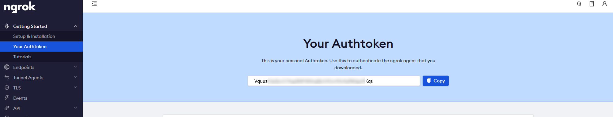

# Smart Collector Information System infrastructure 

This project provides the information system used to deploy the Smart Collector. 

The smart collector is a plastic collector that use Pycom LoPy4 to measure and send the weight of the plastic collecting in the perspective to collect it and recycle it into 3D princting filaments.

Additional information avaialbe on Zenodo (Link to update). 

## Information system architecture
The Smart Collector possess 4 connectivities: LoRa, Sigfox, WiFi and Bluetooth.

This information system is based on **Sigfox** communication. The architecture make the usage of [InfluxDb](https://www.influxdata.com/), [Grafana](https://grafana.com/) and [NodeRed](https://nodered.org/) as illustrated by the following schema.  


## Structure of the repository
  
├ :file_folder: doc : documents used for the documentation  
├ :file_folder: grafana :  
├ :file_folder: influxdb :  
├ :file_folder: ngrok :  
│  └ ngrok.template.yml :  template for ngrok config - it has to be modified and renammed ngrok.yml 
├ :file_folder: nodered :  
│  ├ :file_folder: data : contains settings file for NodeRed 
│  └ Dockerfile :   
├ :page_facing_up: .gitignore : define which file has to be ignored when uploading the project on GitHub/ GitLab   
├ :page_facing_up: default.grafana.env : example of environment variables needed for Grafana. It has to be copied, modified and renamed into `.grafana.env` before starting docker-compose   
├ :page_facing_up: default.influxdb.env : example of environment variables needed for InfluxDB. It has to be copied, modified and renamed into `.influxdb.env` before starting docker-compose  
├ :page_facing_up: docker-compose.yml : docker-compose file that contains settings to start services    
└ :page_facing_up: README.md : this document  

## Deploying the Information System
**Prerequisite** : 
* having a server publicly accessible (with a public IP)
* having installed Docker and Docker-compose on the server

**Operations**
* Pull this repository on the server
* Go to the folder that contains the `docker-compose.yml` file
* Start the services using this command
``` bash
docker-compose up -d #Start the services in background without showing logs, remove -d to see logs
```

## Try Locally the Information System 
**Prerequisite** : 
* having installed Docker and Docker-compose on the computer

**Operations**
* Create an account on ngrok
* Retrieve your ngrok authtoken  

* Pull this repository on your computer
* Paste your ngrok authtoken in the `ngrok.yml` file in the folder `ngrok`
* Go to the folder that contains the `docker-compose.yml` file
* Start the services using this command
``` bash
docker-compose -f docker-compose.ngrok.yml up -d #Start the services in background without showing logs, remove -d to see logs
```


## Docker Commands
``` bash
# start the services listed in the docker-compose.yml file with logs  
docker-compose up 
```

``` bash
# Start the services in detached mode -- without showing logs
docker-compose up -d 
```

``` bash
# Rebuild the images from zero and start the services in detached mode 
docker-compose up -d --force-recreate
```

``` bash
# Stop the services listed in the docker-compose.yml 
docker-compose down 
```

``` bash
# Stop the services listed in the docker-compose.yml and deleted the volume associated with the images
docker-compose down -v
```

# Further Documentation

* [InfluxDB](.\doc\InfluxDB.md)
* [Grafana](.\doc\Grafana.md)
* [NodeRed](.\doc\NodeRed.md)
* 


# Documentation 
[](https://primalcortex.wordpress.com/2016/02/17/sigfox-backend-receiving-and-processing-data/)

[sigfox to node red](https://youtu.be/8F4bSnaID5U)
[NGROK](https://ngrok.com/docs#tunnel-definitions)
[Docker ngrok](https://github.com/wernight/docker-ngrok)
[create a Telegram Bot](https://gist.github.com/ilap/cb6d512694c3e4f2427f85e4caec8ad7)
